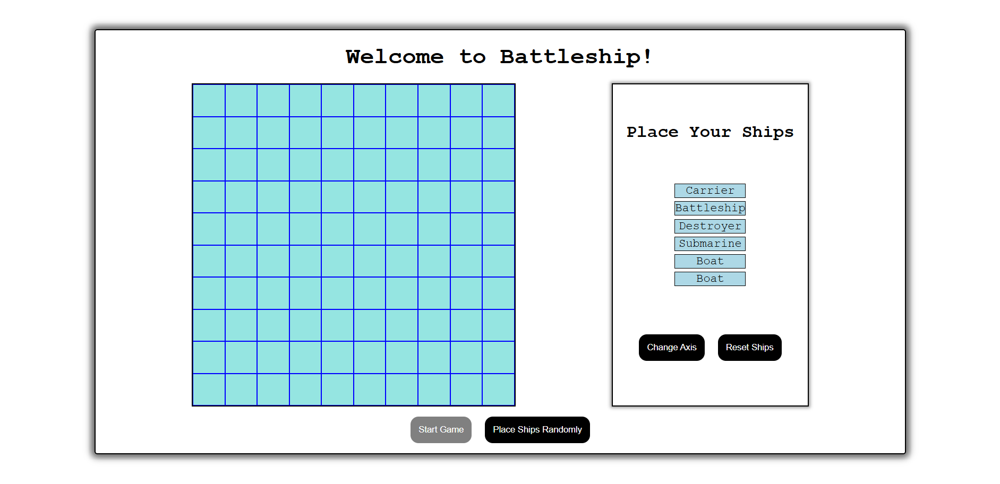

# Battleship Game

A classic Battleship game built using vanilla JavaScript, HTML, and CSS. Place your ships manually or randomly and play against the computer in a clean, responsive interface.

Includes basic unit testing for core logic.
No external libraries or frameworks.

## To run on your pc
1) npm install
2) npx webpack serve

